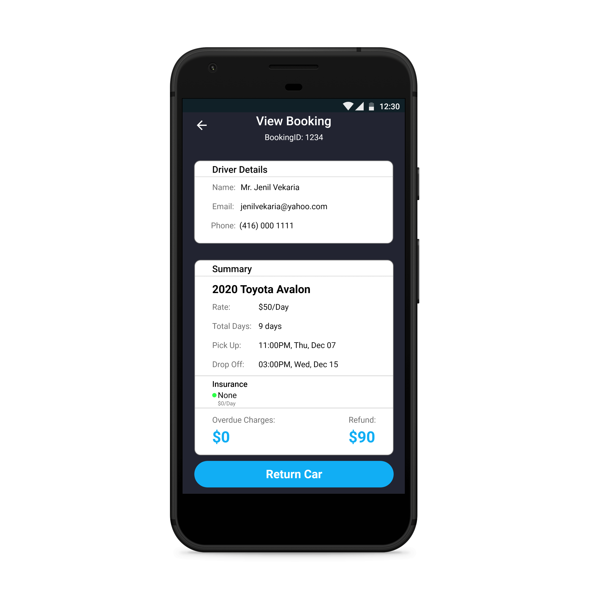

# Car-Rental-Mobile-App
Android mobile app which simulates Car Rental - **Side Project**

**Software:** Android Studio, Adobe XD 
**Language:** Java 
**Designed By:** Jenil Vekaria

**Description** 
For CPS510-Database System we chose to do Car Rental topic and we designed a Java GUI for it. 
However, I wanted it take it bit furthur and decided to build a mobile app for it, so here are the screenshots below of my mobile app.
  

  
 
 
 
 

